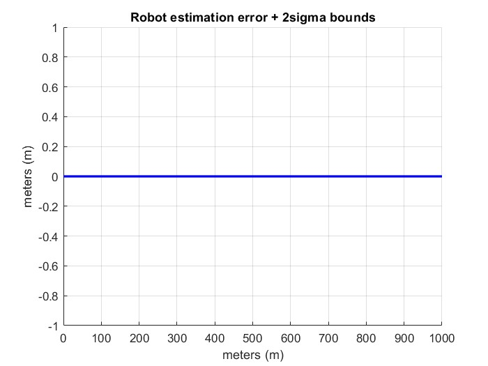
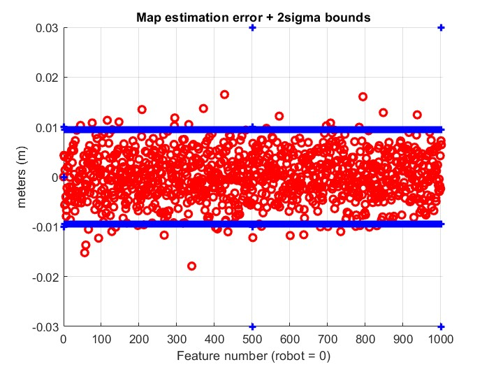
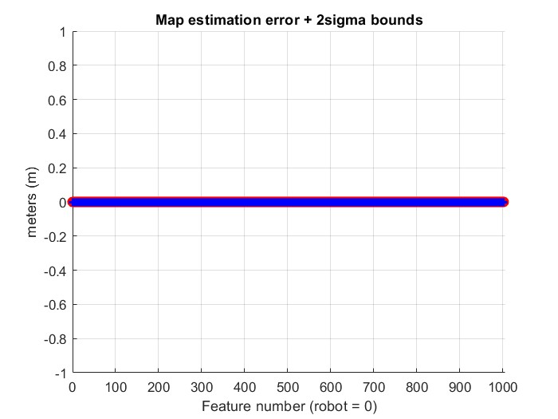

# Problems

## 3.-Assume that Karel has perfect (zero error) odometry. Analise the KF SLAM equations, decide whether KF SLAM is possible, and if it it is, detail what the covariance matrix of the map would look like.

KF SLAM is possible, the variance of the position of the robot (1, 1) will be zero. 
Since feature positions are correlated by the robot odometry and not the sensor, they will have zero covariances and the whole matrix will be diagonal.

The error of the estimation of the map is around zero because of the robot estimation error isn't affecting at all.

## 4.-Assume that Karel has a perfect (zero error) sensor. Analise the KF SLAM equations, decide whether KF SLAM is possible , and if it it is, detail what the covariance matrix of the map would look like.

KF SLAM is also possible, the input variance of the measurements will be zero. 
Since the feature positions still depend on the robot odometry, each position estimation will have the variance of the robot at that step.

The covariance matrix will be similar, just with a smaller variance for the features. Covariances will be the same: the robot variance.
The robot will refine its variance if it detects previously measured features.
If it detects twice some measurement always from the start, the zero starting variance will be propagated, having zero variance on all features and robot.

In the image we are seeing the last case: The robot is sensing repeated features since the beggining, and refines its position from them perfectly to a zero variance odometry. If at some step he looses all the previous features, he will introduce variance on the odometry and all the future feature measurements. 

## 6.-Assume that GPS, with a certain accuracy s2GPS, is available for Karel. Detail how this information could be used in the KF SLAM algorithm. Would it make sense at all for Karel to do SLAM if it has GPS?

KF SLAM will work exactly the same. Since the GPS has also precision error, it is just another sensor measurement to refine the odometry.
The GPS measurements will be used combined with the odometry to refine the robot position and variance, the same as with measurements for the features.

## 7.-Asume that Karel’s initial location uncertainty is not zero but rather s2R0 > 0. How would the final map covariance matrix diagonal look like? How would the final map covariance correlation matrix look like?

The robot will start with a non-zero variance, which will be propagated to the future measurements. The covariance matrix will have bigger values, both in the diagonal and the covariances (which depend on the robot variance).
Correlation will be the same, because it does not depend on the scalar value of the variances.

## 8.-Assume that Karel does not have odometry, but you have a reasonable idea of how large every motion is. Is it possible to run KF SLAM? Provide details.

KF slam is not possible, because this means that we have no error variance estimation/bound on the measurement. 
We can perform other types of SLAM, but with no warrantee that anything is remotely close to reality (unless we have some other real-world measurement/sensor).

We could potentially represent it with an infinte variance on KF SLAM, although it would not provide good results.

## Work distribution
All the work was done by both participants together, during the practice sessions. 